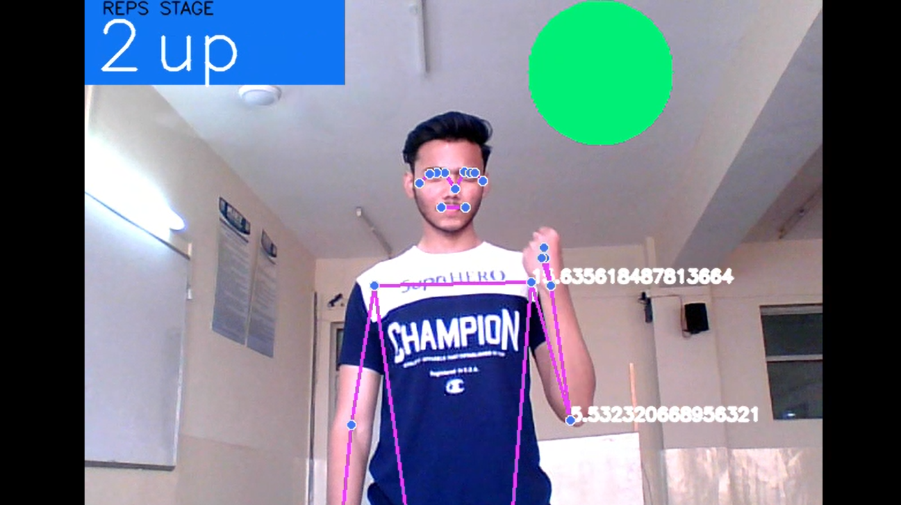
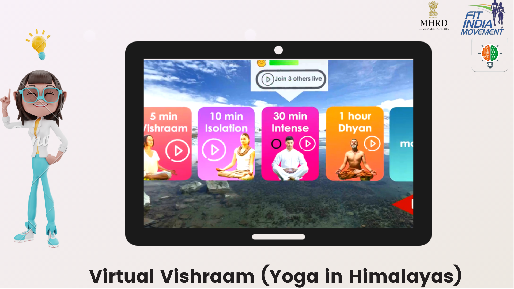
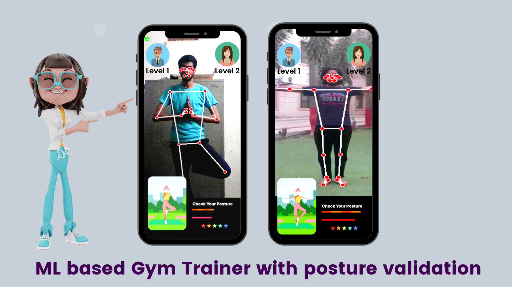
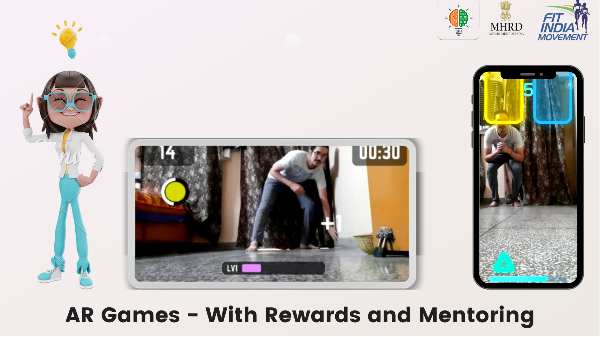
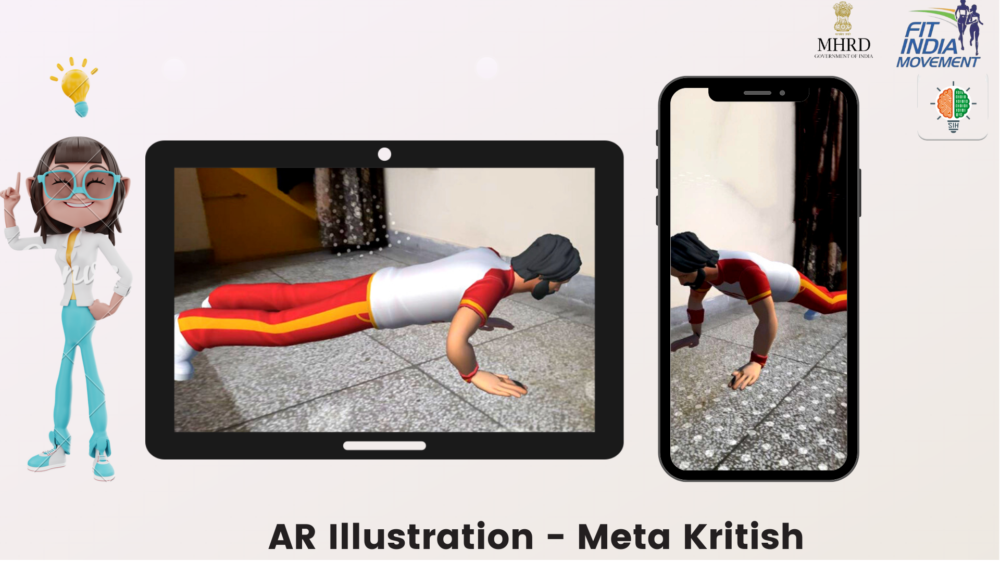
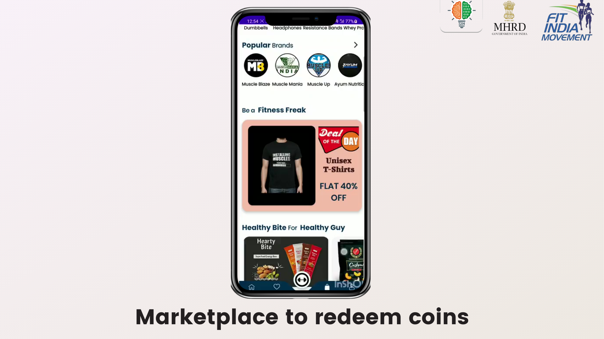
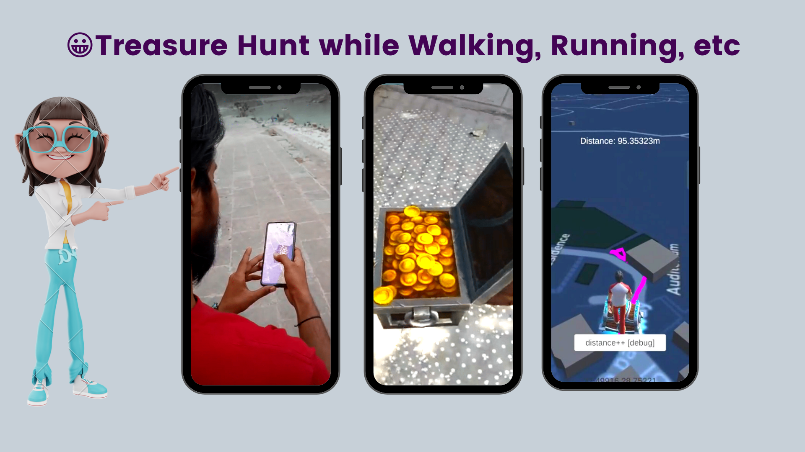
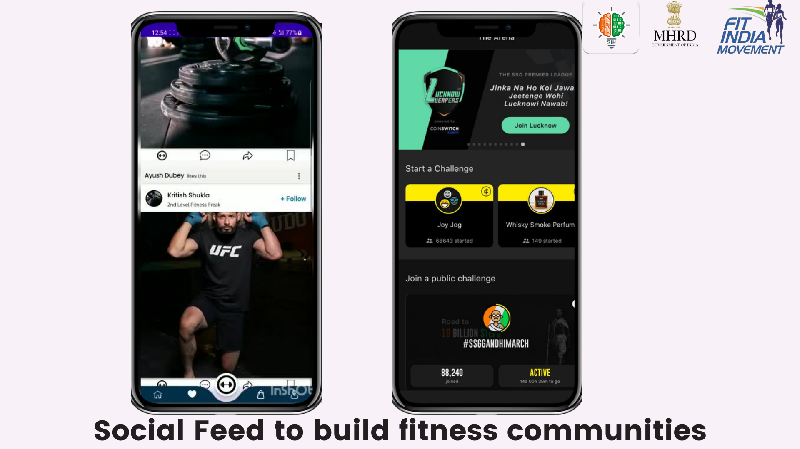

# Problem Statement 
Fitness is the soul of a happy life, it is actually the fuel of every persisting thing. But if we see our country’s health is already at stake and which is itself a threat for the future generations. This need to be rectified and adhering to the updated lifestyle we all have, there is an amazingly successful idea for the same. The one most common thing Indians have among them is a smartphone and a hectic schedule. Taking the same we have the most revolutionary  fitness application which supports gamification in every bit. Fitness is verified through each angle in our application as YOGA, WALKING, RUNNING, CYCLING, HOME WORKOUT and WEIGHT TRAINING. 

# GAMIFIED YOGA
Yoga is added a unique feature of determining the exact postures and correction of the wrong postures through Machine Learning Algorithms. It depicts the accuracy and maintains the level on the basis of the points gained on the performance which are rectified regularly.

 
</img> 

# Virtual Vishram 
It is gamified and made more soothing by adding the true experience of the nature. We landed especially in Kedarnath to give the module a real effect with the help of Virtual Reality. The entire package of Yoga in our app is enough to channelise the true aspects of Yog and asanas.

</img> 
 
# MACHINE LEARNING GAMIFIED TRAINER
An enhanced way of home workout is added with proper validation of the activities through Machine Learning. Also to increase the user’s activities, interactive and enthusiastic games are introduced that supports exercise indirectly. For better understanding there is a virtual Gini which teaches you each module deeply in a 3D model. 

</img> 

# AR Fitness Games
The games are introduced in the application that makes the user indirectly exercise by playing games using his phone’s camera. They are based on augmented reality which allows the user to play the games anywhere possible. These games offer fitness exercise by the greed of winning exciting rewards and unknowingly force the user to stay healthy. 

</img> 

# META AVATAR - VIRTUAL FITNESS BUDDY (INTERACTIVITY)
The another important aspect of Fitness is weight training which is mostly supported in gyms because of the availability of the trainer. But now it is just a click away as the META AVTAAR accompanies the user throughout along with the Genie for the training. Clear indication is given on wrong postures and activities. Points are gained on the basis of regularity, consistency and accuracy and these help in competing at the leaderboard. 

</img> 

# MARKETPLACE
Reward system is distributed in fitness divisions where the user have the liberty to allocate himself as per its division. Further it provides a marketplace to network more users as the points collected on the basis of performance can be redeemed into real rewards. These real rewards are sponsored by companies as they get a marketplace for their business. 

</img> 

# TREASURE HUNT (New reason to walk/run/cycle)
Not only this, true value rewards are added through treasure hunt that makes WALKING, RUNNING and CYCLING a game more than an exercise. The user lands on the map and navigate himself throughout the way which also accounts the distance travelled by him. After crossing a number of checkpoints there is a notification about the treasure which is required to be digged by the user and he earns rewards as a compliment. The daily usual activities are converted into a treasure hunt game.

</img> 

# COMMUNITY BUILDING 
Local Community 
This mobile application have another sparkling feature of practical community building. Being an app it supports notifying the consistent fitness freaks to conduct regular sessions in their locality. Local communities further can combine together to hold weekly events. 

Global Community 
There are global events which connect the users virtually to compete with each other. This gives them a recognised platform to showcase their talent and acknowledge their hard work.

</img> 

## Badges

